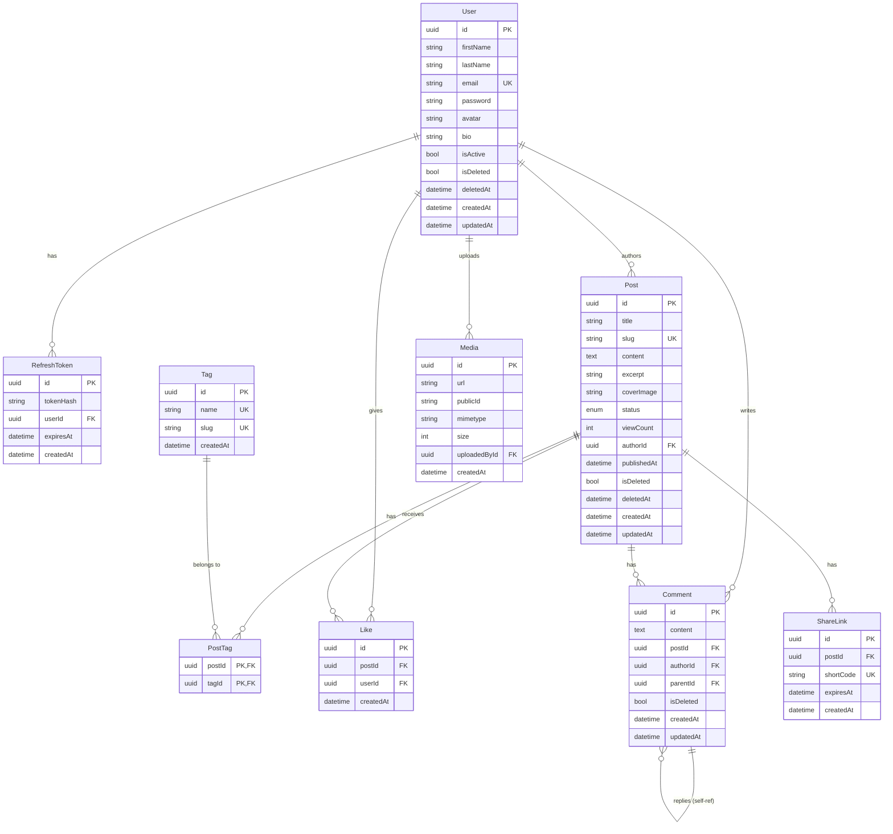

# Entity Relationship Diagram

## Relationships

| Relation | Type | Notes |
|---|---|---|
| User → RefreshToken | 1:N | Cascade delete |
| User → Post | 1:N | Author owns posts |
| User → Like | 1:N | Cascade delete |
| User → Comment | 1:N | No cascade (keep thread) |
| User → Media | 1:N | Uploaded files |
| Post → PostTag | 1:N | Cascade delete |
| Post → Like | 1:N | Cascade delete |
| Post → Comment | 1:N | Cascade delete |
| Post → ShareLink | 1:N | Cascade delete |
| Tag → PostTag | 1:N | Cascade delete |
| Comment → Comment | 1:N | Self-referential (parentId), `NoAction` on delete |

## Constraints

- `Like(postId, userId)` — unique together, prevents duplicate likes
- `PostTag(postId, tagId)` — composite PK, prevents duplicate tags on a post
- `ShareLink.shortCode` — unique, indexed for fast lookup
- `Post.slug` — unique, indexed
- `User.email` — unique
- `Tag.slug` — unique
